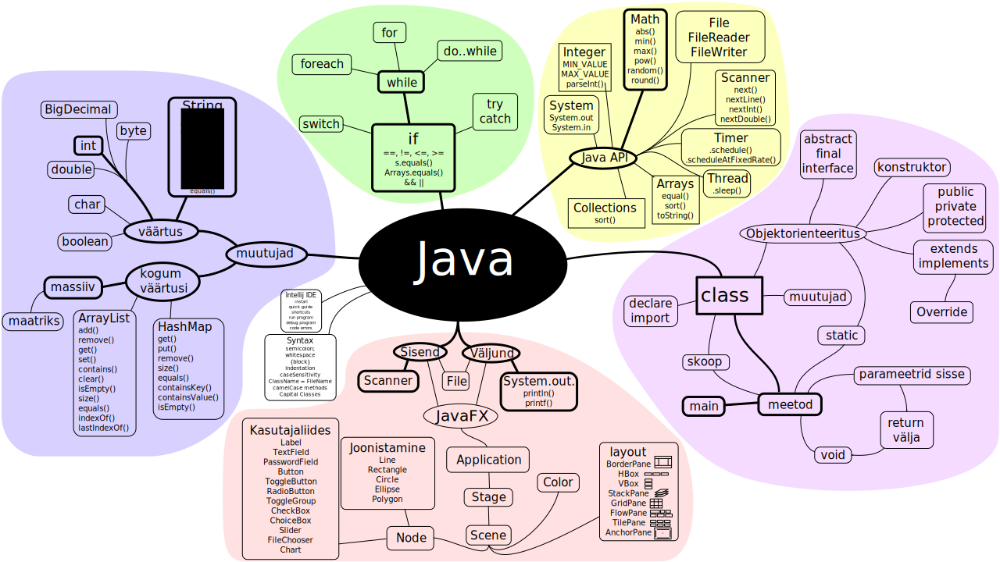
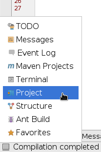
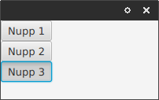
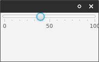
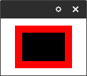
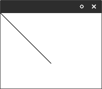
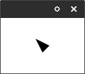

::: toc
@[toc]( )
:::




Tere,

Kui soovid programmeerijaks õppida, oled õiges kohas. Käesolevad materjalid on loodud IT Kolledži tarbeks, aga siht on võimaldada igaühel programmeerimist õppida *põhjalikult*. Materjalid pole veel valmis, aga võid juba proovida, kuidas hammas peale hakkab ja tagasiside kirjuta foorumisse.

Meie ühine vestlusplatvorm küsimuste ja muu teemakohase loba jaoks on [kommuun.koodikool.ee](http://kommuun.koodikool.ee).

Krister

# Aineprogramm

## Ajagraafik

25 september - Sissejuhatav loeng
7 oktoober - **1. projekti vaheetapp**
8 oktoober - Praktikum
28 oktoober - **2. projekti vaheetapp**
29-30 oktoober - Praktikum
20 november - Praktikum
11 detsember - Praktikum
7-8 jaanuar - **Projekti vastamine**
27-28 jaanuar - Kordamine
29 jaanuar - **Eksam**

Kordussooritusi on kaks. Kolmandat kindlasti ei tule.

Praktikum ei olegi tegelt üldse praktikum. See on hoopis konsultatsioon. Tule oma arvutiga või kasuta kooli oma, aga lõpuks teeme tööd su enda projekti kallal.

## Hindamine

- 60 punkti tuleb projekti eest
    - 5p esimesest vaheetapist
    - 10p teisest vaheetapist
    - 45p kaitsmisest
- 40 punkti eksami eest
    - Lävend 50%
    - Kui < 50%, siis on kogu aine 0
- 10 lisapunkti
    - 1p kommuunis topicu avamise eest
    - 1-10p käesoleva lehe täiendamine

## Projekt

Projekt on kõige tähtsam asi selle aine juures. Projekt on see, millega peaksid koguaeg tegelema. See annab reaalse kogemuse reaalsete probleemidega ja on ühtlasi ka kõige huvitavam viis asi selgeks saada.

### Idee

Et ikka põnev oleks, saad päris oma programmi kirjutada. Ära idee leidmise pärast liialt vaeva näe. Kui endal pähe ei tule, siis leia mõni olemasolev programm ja matki see järgi. Võib teha ka mängu.

### Idee kinnitamine

Sellist ametlikku asja, nagu "kinnitamine", meil ei ole. Kui postitad foorumisse oma idee on see vaid tagasiside saamiseks. Sealjuures ei pea liialt vaevama end idee välja mõtlemisega. Kui kursuse keskel avastad, et teeks hoopis midagi muud, siis palun väga - tee. Siiani kulutatud aeg kindlasti ei ole maha visatud.

### Näited

Lae alla aasta [2015 tudengite mõned tööd](http://enos.itcollege.ee/~kviirsaa/projekti_naiteid_2015.zip). Käivita Linuxis, Windowsis või Macis käsuga `java -jar failinimi.jar`.

### Eeldatav tulemus

#### Keerukus

Point on ennast proovile panna. Siis on huvitav ja siis õpib. Ma ei mõtle, et peaksid nüüd päeva pealt profiks hakkama, aga võta ikka mõnuga. Siin tuleb täheldada seda, et kui teed lihtsa idee ära, siis seda saab alati keerulisemaks täiendada - lihtne on hea. Ühtlasi peaks keerulisele programmile lähenema tema kõige lihtsamast küljest ja siis vaikselt täiendama - keeruline on ka hea. Lühidalt - võta mingi idee ja hakka pihta!

#### Maht

Projekti mahtu on väga raske hinnata. Asi on selles, et kui algaja kirjutab 1000 rida koodi probleemi lahendamiseks, siis edasijõudnud teeb sama asja 100 reaga ära. See ei ole kirjand ja koodi koguse järgi projekti kvaliteeti hinnata ei saa. Küll aga annab hindamise kriteerium sulle aimu, milliseid tehnilisi lahendusi tähele pannakse hindamisel.

### Aga ma ei oska ju progeda!

Kõik on hästi. Kui sa kujundad oma programmi paberil ära, mõtled läbi, mis funktsionaalsus sinna tuleb, on juba esimene samm tehtud. Nüüd. Kui sul on [i200 videod](https://www.youtube.com/playlist?list=PLWkgPad9kpY1Ns3Q23g1qAlE9vQbmpSKn) vaadatud, äkki isegi codecademy.com mõni Pythoni kursus tehtud, siis peaksid oskama Javas kõige lihtsamaid manöövreid teha: arvutada, kasutajalt sisendit küsida, tulemus välja printida. Kas sinu (ükskõik kui keerulist) programmi annab konsoolis ära teha mingil elementaarsel tasemel? Ehk tee kõige lihtsam variant kohe ära. Kui midagi juurde õpid, saad täiendada ja kindlasti ära karda nullist uuesti kirjutamist, see arendabki tegelikult kõige rohkem.

### Vastamine

Nagu iga õige projekt (näiteks lõputöö) tuleb projekt kaitsta kõigi ees. Esitamisel võid kasutada kooli arvutit, aga enda masinast on ikka kõige kindlam. 

Esinemine näeb välja midagi sellist:

* Jaga oma giti repo publikuga
* Pane programm käima [2min]
* Selgita ühte koodijuppi, mille üle oled eriti uhke [2min]
* Publiku küsimused ja õppejõu tagasiside koos hindega [2min]

### Hindamine

Nonii. "Ükskõik kui keeruline või lihtne" on tore, aga mille eest reaalselt hinde saab? Siin on siis täpne hindamise kriteerium. **Boldis** punktid on hädavajalikud ja ilma nendeta hinnet ei saa.

### Kood

*   **Kood on gitis**, õppejõud saab ligi.
*   **Võõras kood on allikale viidatud**
*   Programmi sisu
    *   **Programm käivitub**
    *   Kasutajaliidese olemasolu
    *   Puugid ei takista protsessi
*   Projekti kirjeldus failis README.md (.md on [markdown](http://eherrera.net/markdowntutorial))
    *   Nimi
    *   Projekti kirjeldus
    *   Kasutusjuhend
    *   Litsents
*   Lihtne lugeda
    *   kood ei ole spagetistunud
    *   muutujate, meetodite jm. nimetused on mõistetavad
    *   selguse tagamiseks on koodi kommenteeritud
*   Optimaalne ja taaskasutatav ülesehitus
    *   kasutab objekt-orienteeritust
    *   koodis ei ole ülearu kordusi
*   Kood on kompaktne (lisapunktid, kui on näha erilist läbimõeldust)
    *   keerulised tsüklid
    *   rekursioon
    *   eriti hea klasside/meetodite taaskasutatavus
* Lisapunkte
    *   Tudeng on läinud aine raamistikust edasi ehk oskab rohkem kui on aines õpetatud.
    *   Tudeng on reaalselt gitti kasutanud (committide periood on loogiline)
    *   Kasutatud on lisa raamistikke, näiteks SQL andmebaas.
    *   Kui tudeng tööga päris valmis ei saanud, kas ta vähemalt teab mida järgmiseks peaks tegema?

### Plagiaadikontroll

(Rakendada ainult kui väga vaja, eksam on lõplik filter)

*   Oskab selgitada suvalist kohta koodis.
*   Oskab programmi käiku muuta, kui õppejõud seda palub.
*   Oskab käigu pealt tsükleid valmistada.

## Eksam

### Reeglid

- Hilinejaid sisse ei lubata.
- Eksam toimub klassi arvutis.
- Telefoni ei näpi. Nimelt on kooli arvuti ainuke ekraan sinu elus.
- Ei tohi kellegagi suhelda ei netis ega mujal v.a. õppejõuga.
- Arvesse läheb ainult esimene giti link - valida ei saa.
- Tohid kasutada internetti k.a. Google.
- Üleüldised sohi tegemise reeglid kehtivad (nt. naabrilt maha kirjutamine).
- Kõik ülesanded peavad olema lahendatud kasutades päris programmeerimise võtteid ja mitte lihtsalt näilisi lahendusi kirjutades.
- Aega on 3 tundi.
- Kui oled valmis, lae lahendused üles samasse reposse, kust nad said. Kui laed GitHubi või mujale avalikku kohta on tegu plagiaadi kaasa aitamises. Lahendusi võid jagada märtsis, kui kõik eksamid on ära olnud.
- Kui koodi pushimine gitiga ei õnnestu, siis saada failid kokku pakitult (zip/rar/tar) mulle meilile: krister.viirsaar@itcollege.ee. Kaasneb 5p penalt. Copy-paste koodi ma vastu ei võta.
- Õppejõud ei kontrolli, kas su töö läks gitti üles. Seda saad ise teha.
- Küsimusi võib küsida, aga tõenäoliselt oled ise midagi valesti teinud :)

### Soovitusi

- Tule klassi palju varem ja kinnita, et Intellij on seadistatud.
- Kui ülesanne on üle jõu siis lihtsusta enda jaoks, aga ära jäta programmi katki.
- Ära copy-paste! Ülesanded on piisavalt lihtsad, et ajavõitu ei ole. Aga kui sa ei tea täpselt, mis teed, siis nüüd kaotad aega.
- Ära kiirusta, mõtle läbi. Alati on lihtsam ja kergem lahendus olemas.
- Kui googeldad, siis ära otsi lahendusi ülesandele, vaid vastuseid oma küsimustele!

## Väliseid ressursse

Igaühel on oma viis õppimiseks, seega siin on hea nimekiri erinevatest online ressurssidest.

Paljud materjalid on hoopis Pythoni kesksed. See on väga hea. Python on hea algaja keel, millelt on lihtne Java peale ümber tulla.

### Videod

*   [i200 õppevideod](https://www.youtube.com/playlist?list=PLWkgPad9kpY1Ns3Q23g1qAlE9vQbmpSKn)
*   [Bucky Roberts](https://www.youtube.com/watch?v=Hl-zzrqQoSE&list=PLFE2CE09D83EE3E28) Üks tudengi lemmik
*   [Udemy](https://www.udemy.com/java-tutorial/) väga hea kursus
*   [Stanford](http://web.stanford.edu/class/cs106a/)i ülipopulaarne kursus
*   [Java Programming - Step by Step](https://www.youtube.com/watch?v=3u1fu6f8Hto)
*   [Why is programming hard?https://youtu.be/BRaBWIcAqlQ
*   [PluralSight](http://www.pluralsight.com/)
*   [Coursera](https://www.coursera.org/course/pythonlearn)
*   [Khan Academy](https://www.khanacademy.org/computing/computer-programming)

### Interaktiivne

*   [TurtleAcademy](https://turtleacademy.com/learn.php) õpetab lihtsaid asju eriti loomulikul moel.
*   [Hour of Code](http://hourofcode.com/)
*   [CodeCademy](http://www.codecademy.com/tracks/python)
*   [CodeCombat](https://codecombat.com/)
*   [Programming Basics](http://www.programmingbasics.org/en/)
*	[CodingGame](https://www.codingame.com)

### Tekstipõhine

*   [Objektorienteeritusest](http://sepwww.stanford.edu/sep/jon/family/jos/oop/)
*   [JavaNotes](http://math.hws.edu/javanotes/)
*   [MetsHein (eesti keeles)](http://metshein.com/)
*   [Tartu Ülikooli "Programmeerimisest maalähedaselt"](https://courses.cs.ut.ee/2015/progmaa/spring)
*   [Tartu Ülikooli "Programmeerimise alused"](https://courses.cs.ut.ee/2016/eprogalused/spring)
*   [The 5 basic concepts of any programming language](https://howtoprogramwithjava.com/programming-101-the-5-basic-concepts-of-any-programming-language/)
*   [Learn without stress](http://www.makeuseof.com/tag/learn-programming-without-stress/)
*   [TutorialsPoint](http://www.tutorialspoint.com/java/)

### Raamatud

*   Head First Java
*   [Learn Java the Hard Way](https://learnjavathehardway.org/)

### Muu

*   [Don't Call Yourself A Programmer, And Other Career Advice](http://www.kalzumeus.com/2011/10/28/dont-call-yourself-a-programmer/)

## Progemine praktikas

On mõned põhitõed, mida enne päris maailmas tegutsemist tavaliselt ei õpi. Siin on kiire ülevaade.

1.  Programmeerimine on katse-eksitus meetodi maailm ehk seda teevad nii algajad kui ka profid. Seega proovi ja katseta. Tee vigu, arvuti sinust ei tüdine. Kui lõpuks midagi tööle saad, on võit tööd väärt.
2.  Ära karda programmi uuesti kirjutamist. Iga ümberkirjutamisega tuleb sul parem arusaam, kuidas asi tegelikult peaks olema. Alguses proovi lihtsalt midagi tööle saada.
3.  Kolmandal ümberkirjutamisel on sul juba päris hea programm.
4.  Google on progeja parim sõber. Internet on suur teadmiste pank ja pole kedagi, kes kõike peast teaks. Kuid tark ei kopeeri pimesi koodi, vaid õpib seda mõistma ja kasutab vaid vajalike osi.
5.  Iga programm võtab kordades rohkem aega, kui oskasid arvata. [Optimism on elukutsega kaasnev oht](http://blog.codinghorror.com/defeating-optimism/).
6.  Efektiivse programmi loomine algab korralikust eeltööst. Pea ees sisse hüpates saad katsetada ja mängida, aga mitte midagi tõsist teha. Läbi on vaja mõelda nii otstarve, funktsionaalsus, kujundus kui ka programmi enda arhitektuur.
7.  Juunior / arendaja / senior on kolm tiitlit, mida võid omistada. Juunior on muidugi õpilane. "Arendaja" oled siis, kui saad iseseisvalt hakkama ja senioril on kuskil 7 aastat kogemust ja oskab ka kõige keerulisemaid probleeme lahendada. Kuskil seda kirjas muidugi ei ole ja antud kirjeldus on vaid mulje.
8.  Arvuti ei tee vigu. Inimesed teevad vigu. Inimene oled sina, olen mina ja on kõik need, kes on Java ja kõik muu tarkvara kirjutanud. Aga enne kui teisi süüdistad, tee 100% kindlaks, et viga pole sinu enda koodis.
9.  Tarkvara arendaja on küll ainus meeskonnaliige, kes on hädavajalik, et tarkvara toode valmis saada, aga ta kindlasti pole ainuke oluline. Et tootest asja saaks on vaja disaini, äri, arhitektuuri, kasutajatoe ja muid inimesi.

# Peatükid

Peatükid on iganädalased õppematerjalid ja harjutused. Võta aga esimene ette ja hakka õppima :)

## Weekly 1

Tsau!

Lahe on näha nii palju huvilisi programmeerimisele. Pole meist keegi nii hipi, et ei kasutaks nutitelefoni, arvutit või internetti. Kuidas on siis võimalik, et suurem osa meist ei oska ise 21. sajandi kirjaoskust? Pole ime, et programmeerijatel nii vinged palgad on - neid on ju igas ettevõttes vaja. Postiteenusest arstideni. Igasugune automaatika on aja, ehk raha, võit. Kas kuskil Eestis on veel ettevõte, kellel ei ole kodulehte? Okei ma mõnda isegi tean, aga tegu ei ole kasvavate ettevõtetega.

Märkusena lisaksin, et teen seda kursust käigu pealt ja põlve otsast, põhitöö kõrvalt. Okei roolis ma ei tee midagi. Mida see tähendab on see, et kohati on videote kvaliteet vahel madal ja kohati on asjad läbimõtlemata. Aga mis veel tähtsam - **anna igal võimalusel tagasisidet**, et kuidas see aine sulle on kujunenud. Mis jäi arusaamatuks, mida oleks veel vaja. Mida rohkem küsid/räägid, seda parem kursus see meile kõigile tuleb!

### Challenge

*Selle weekly ülesanded. Kui hätta jääd hüppa "õpetused" sektsiooni.*

1. Installi [Java 8](http://i200.itcollege.ee/#Arenduskeskkond)
1. Kirjuta [Hello World](http://blog.hackerrank.com/the-history-of-hello-world/) programm kasutades mingit suvalist text editori. 

    ```
    public class HelloWorld {
        public static void main(String args[]) {
            System.out.println("Hello World!");
        }
    }
    ```

1. Kompileeri ja käivita see programm nii, et näed tulemust. ([Windowsis](http://kommuun.koodikool.ee/t/windows-ja-java/292))
1. [Installi git.](https://git-scm.com/book/en/v2/Getting-Started-Installing-Git)
1. Tee omale GitHub.com konto ja lae oma projekt gitiga sinna üles.
1. Loo oma repositooriumi ka README.md, kus seletad oma projekti olemust.
1. Kui tahad tagasisidet oma projekti mahule/keerukusele, siis tee uus topic ja viita README-le.
1. Boonus: Installi [IDE](http://www.dummies.com/programming/java/what-is-an-integrated-development-environment/), millega hakkad koodi kirjutama. Kasuta mida tahad, aga soovitan [IntelliJ Community Edition](https://www.jetbrains.com/idea/). Ja käivita seal samas ka see programm.

### Õpetused

1. [Sissejuhatus](https://youtu.be/S6mzCU4zZaQ?list=PLWkgPad9kpY3IWcuywjrCVQgFiF5MhEMp) (tudengitel läbitud loeng)
1. [Programmeerimisest üldisemalt](https://youtu.be/6WOof5MfHow?list=PLWkgPad9kpY3IWcuywjrCVQgFiF5MhEMp).
1. LaevadePommitamine: [Git ja Hello World](https://youtu.be/P1s2_MQqskQ) ([kood](https://github.com/KristerV/javaLaevadePommitamine/tree/week1))

### Lingid

[Eli the Computer Guy](https://www.youtube.com/watch?v=lJnvq0A_7WQ)
[i200 materjalides](http://i200.itcollege.ee/#Vliseid_ressursse)
[SoloLearn](http://kommuun.koodikool.ee/t/week-1-introduction/49/26?u=kristerv)
*Kui leiad mõne hea materjali siis täienda materjale!*

## Weekly 2

Tundub, et saime äkki selle küsimise soone lahti. Kui ma selle aasta kursust kujundama hakkasin alguses, tahtsin tegelikult tehagi ainult küsimus-vastus kursuse. Ehk, et saaksite ise ainet juhtida (muidugi räägiksin ikkagi kõik olulised asjad ära). Eelmise aasta tudengid tegid aga selgeks, et lahtiste juhtmetega aine ei ole piisav. Seega otsustasin vähe traditsioonilisema teekonna kasuks.

### Challenge

- [javaHarjutused](https://github.com/KristerV/javaHarjutused) Teema 1
- Tee oma projektist konsoolipõhine esimene versioon.
- Lisaharjutusi: [Codingbat 1](http://codingbat.com/java/Warmup-1) ja [Codingbat 2](http://codingbat.com/java/Warmup-2)

### Õpetused

- [Windowsi nõuandeid](http://kommuun.koodikool.ee/t/windows-ja-java/292/5)
- [Progemise algõpe](https://www.youtube.com/playlist?list=PLWkgPad9kpY1Ns3Q23g1qAlE9vQbmpSKn)
- [Booleanid ja operaatorid](https://youtu.be/gjxBTo37n8M) (lisaks [nimekiri kõikidest operaatoritest](https://docs.oracle.com/javase/tutorial/java/nutsandbolts/opsummary.html))
- Laevade Pommitamine: [Konsooli programm, for tsükkel, maatriks](https://youtu.be/WZdx5IJKuPE) ([kood](https://github.com/KristerV/javaLaevadePommitamine/blob/week2/src/Main.java))
- Mis asi on [.gitignore](https://youtu.be/ln1Sa0aFhH4)

*NB! Kui sa veel `javac` käsuga toime ei tulnud, siis ära sellega rohkem tegele. See oli vaid harjutus, et mõista kompileerimise olemust ja edaspidi me seda ei kasuta.*

### KKK

#### Kuidas ma projekti struktuuri ehitan?

Praegu me ei ole veel sinna jõudnud. Võta rahulikult ja ehita projekt konsooliprogrammina esiteks valmis.

#### Kuidas ma objekte kasutan?

Vt. eelmist küsimust.

#### Kui ma kasutaja sisestatud andmed salvestan, faili?

[SQLite](http://www.sqlitetutorial.net/sqlite-java/) on hea andmebaas, aga jällegi - tee esiteks omale algoritmid selgeks.

### Tudengitele

#### Lisapunkte ei saa küsimuste vaid topicute eest
Vabandan, et kohe omale selgeks ei teinud. Ma lihtsalt et saa küsijaid siin foorumis kuidagi premeerida - tehniline keerukus. Seega, **punkti saab hoopis [topicu alustaja](http://i200.itcollege.ee/#Hindamine)**. Eriti ebaaus on see vastajatele. Juba nüüd on olnud väga häid vastuseid näha ja ma annaksin hea meelega punkte selle eest, aga selle info välja kloppimine on liiga keeruline. Aga abistada on enivei väga mõnus :) Muide - jah, kui tegid projekti topicu siis see saab ka punkti.

#### Vaheetapp 7. oktoober

Selleks ajaks tahan kahte asja: 

1. Kirjuta oma giti link siia: [Google Forms](https://goo.gl/forms/1zfgeq7Suy567mow1).
1. Et seal projektis oleks Hello World tehtud.

[Vaheetapi KKK](http://kommuun.koodikool.ee/t/kusimus-giti-lingi-kopimine/320).

#### Praktikum on konsultatsiooni aeg

Praktikum, mis meid nädalavahetusel ees ootab, on ennekõike konsultatsioonideks. Vahet pole mis staadiumis su projekt on, kas ta üldse alustatud on, tule ja räägime sellest. Ma pole detailides kindel kuidas asja läbi viia, aga kõige halvemal juhul saad sa lihtsalt oma projekti kallal tööd teha.

Kaasa võta kas oma arvuti või kasuta kooli oma - su enda valida. Intellij ja Git on Linuxis täitsa olemas (ja seda ei pea kartma).

#### Edasijõudnutele

Tere sina, kes sa oled juba jagad Objekte ja kasutajaliideseid. Palun praktikumis sinu abi. Nimelt inimesi on väga palju ja oleks tore, kui aitaksid mul selle läbi viia. Eesmärgiks on harida võimalikult palju algajaid ja sealjuures oma suhtlemise/seletamise oskusi täiendada. Jagan ka punkte. Tule tunni alguses kohe mu jutule ja paneme mingi plaani paika!

## Weekly 3

Kuna vahepeal oli tudengitel õppimise nädalavahetus, siis on weekly veidi lahjem. Aga siiski oluline - räägime kasutajaliidesest. Ühtlasi otsustasin kolida weeklydega siia lehele, sest on materjal vähe rohkem käepärast ja ka kõigi poolt muudetav (kui tekib tahtmine midagi täiendada).

### Challenge

- [javaHarjutused](https://github.com/KristerV/javaHarjutused) Teema 2
- Kirjutada oma projektile kasutajaliides - kõik funktsionaalsused ei pea toimima. Pealselt, et kuskile liikuda saab (kasutaja protsessi mõttes).

### Õpetused

- [Massiivid, ArrayListid ja HashMapid](https://youtu.be/kb9IRtb_pRY)
- [JavaFX](https://youtu.be/OXIgXp64LXk)
- LaevadePommitamine: JavaFX

## Weekly 4

**Käesolev weekly on veel arendamisel**

### Õpetused

- Meetod, klass, objekt
- UML ja projekti struktuur
- LaevadePommitamine: objektideks

## Weekly 5

**Käesolev weekly on veel arendamisel**

### Õpetused

- Rekursioon
- Automaattestid ja TDD

# Tööriistad

## Arenduskeskkond

#### Java 8

Java 8 saad alla laadida ja installida [siit](http://www.oracle.com/technetwork/java/javase/downloads/jdk8-downloads-2133151.html).

On soovitatav kasutada **ametlikku Oracle JDK** (üleval olev link) ja mitte OpenJDK, sest JavaFX ei ole OpenJDK's koheselt sees ja selle lisamine võib olla päris problemaatiline.

#### Intellij

Intellij saad alla laadida ja installida [siit](https://www.jetbrains.com/idea/download/).

##### Kasutamine

Ennekõike on Intellij lihtne tekstiredaktor. Tal on palju kiirteesid (allpool räägime veel) ja muid võimalusi. Räägime kõige tähtsamast.

##### Esimene käivitus

Esmane käivitus võib olla vähe keeruline - järgime [piltidega õpetust siin](https://www.jetbrains.com/help/idea/2016.2/tutorial-creating-running-and-packaging-your-first-java-application.html).

##### Jooksuta programm

Programmi käivitamiseks on lihtne otsetee `ctrl + shift + f10`. Kui oled juba ühe korra käivitanud oma programmi, piisab ka lühemast `ctrl + f10` otseteest. Vt. ka [kiirklahve](/#Kiirklahvid)

##### Debug

Kui soovid näha, kuidas täpselt su programm jookseb - rida rea haaval - siis Debug funktsioon on selle jaoks. Hoiatan, et erinevalt programmi tavapärasest käivitamisest võib see väga kaua aega võtta. Uuri lähemalt [Debug videos](/#Videod).

##### Failide vaade

Kui sul on failide vaade kadunud, leiad selle üles all-paremal olevast ikoonist.



##### Kiirklahvid

Jumala kiirklahv on ctrl + shift + a, see on kõikide käskluste otsing.

`ctrl + shift + a`

Otsing: kõik Intellij käsklused

`shift + f10`

Käivita programm (olemasolevate seadetega)

`ctrl + shift + f10`

Käivita programm (loo uued seaded)

`alt + enter`

Paranda kursori all olev viga.

`ctrl + shift + üles/alla`

Viib kas rea või koodi jupi üles/alla

`alt + j`

Selekteeri järgmine identne koodijupp

`shift + alt + click`

Lisa veel üks kursor

`shift + alt + insert`

Muuda selekteerimine ploki kujuliseks

`ctrl + click`

Mine pärinevuse juurde.

`ctrl + space`

Autocomplete ehk soovita midagi, mis siia võiks sobida.

`ctrl + w`

Laienda selektsiooni

`F2`

Mine järgmise errori juurde.

`ctrl + q`

Loe kursori all oleva elemendi JavaDocsi.

`ctrl + shift + enter`

Lõpeta lause ja lisa semikoolon.

##### Kiirkäsud

kirjuta käsk ja vajuta enter. Näiteks `sout + enter` kirjutab `System.out.println()`.

**sout**

    System.out.println()

**soutv**

    System.out.println("a = " + a)

**psvm**

    public static void main()

**fori**

    for (int i = 0; i < x; i++) {}

##### Probleemid

##### Täpitähed

Kui täpitähed ei ilmu JavaFXis või konsoolis, siis on lahendus lihtne:

File -> Settings -> Editor -> File Encodings -> IDE ja Project Encoding peavad olema UTF-8 mõlemad.

## Git

Programmeerides võid kergesti hulluks minna ja üks põhilisi päästerõngaid on Git.

**Git on versioonihaldussüsteem, mis teeb kolme asja eriti hästi:**

*   Hoiab [tagavarakoopiaid pilves](https://github.com/KristerV/javaCheatsheet), juhul kui meie arvutiga peaks midagi juhtuma.
*   Võimaldab [tervel meeskonnal](https://github.com/torvalds/linux/commits/master) ühe programmiga samaaegselt toimetada
*   Salvestab [programmi staadiumeid](https://github.com/KristerV/javaCheatsheet/commit/345f768a29425352e222a0a04d61806a33ad2c56), et kriitilise vea korral saab versioone tagasi kerida.

Giti kasutamine on lausa hädavajalik ja olen isiklikult näinud vaid ühte professionaalset arendajat, kes seda ei kasuta (pärast meie kohtumist kasutab). Muidugi on versioonihaldussüsteeme rohkemgi, kuid Git on vaieldamatult üks parimaid.

Gitiga võid hoida oma koodi ükskõik kus - meeskonna liikmete arvutites, oma serveris, mõnes pilveteenuses. Üks populaarsemaid pilveteenuseid avatud lähtekoodiga tarkvaral on [GitHub.com](https://github.com/).

Siin on mõned välised ressursid, mis aitavad teemat mõista:
*   [https://try.github.io/](https://try.github.io/) - proovi ja harjuta git'i käsurida brauseris.
*   [git-scm.com](http://git-scm.com/doc) - sõbralik ja põhjalik ametlik dokumentatsioon.
*   [try.github.io](http://try.github.io) - Interaktiivne õpetus.
*   [GitHub Youtube](https://www.youtube.com/watch?v=8oRjP8yj2Wo&list=PLg7s6cbtAD165JTRsXh8ofwRw0PqUnkVH) - Video õpetus.
*   [Roger Dudler](http://rogerdudler.github.io/git-guide/) - isetehtud õpetus.
*   [guides.github.com](https://guides.github.com/) - GitHubi kasutamisest.
*   [Atlassian](https://www.atlassian.com/git/tutorials/setting-up-a-repository/git-config) - Git, Tudeng soovitas.

#### Käsklused

Soovitan Gitti kasutada käsurealt, et seda mõista. On olemas ka [kasutajaliidesega tarkvara](https://desktop.github.com/), kuid algajale võib see eriti keeruliseks osutuda.

Muuda käesolev kaust Giti repositooriumiks

    git init

Lae alla aadressil olev koodi repositoorium

    git clone https://github.com/KristerV/javaHarjutused.git

Tõmba alla repositooriumi uuendused

    git pull

Vaata üldist seisu

    git status

Vaata, mis koodi oled muutnud pärast viimast salvestatud seisu

    git diff

Valmista üks fail ette salvestamiseks

    git add path/to/file.java

Valmista kõik failid ette salvestamiseks

    git add --all

Salvesta ettevalmistatud failid

    git commit -m "lühikirjeldus tehtud muudatustest"

Lükka repositooriumi uuendused üles

    git push

Vaata projekti ajalugu

    git log

Tühista salvestamata muudatused

    git checkout .

#### .gitignore

Kõiki faile ei ole meil vaja Gitti salvestada. Näiteks on Javas kompileeritud .class failid, millest pole hiljem kuigi palju kasu.

.gitignore on fail, millega saad faile ja kaustasid Giti eest ära peita.

Näiteks Java projekti puhul tahad salvestada src/ kausta, aga mitte out/ ega .idea/ kaustasid (.idea on Intellij konfiguratsioonid, millest sinu meeskonnakaaslastel on igaühel oma). Siis loo uus fail nimega .gitignore oma projekti algsesse kausta järgneva sisuga:

    out/
    *.iml
    .idea/

`*.iml` ütleb veel lisaks, et me ei taha ühtegi faili salvestada, mis lõppeb .iml-iga.

Näitena võib tuua [javaHarjutused repositooriumi](https://github.com/KristerV/javaHarjutused).

## Muutujad


Muutuja on sisuliselt nagu kast, kuhu saad ühe asja sisse panna. Sa pead ütlema, kuidas kasti nimetada ja mis tüüpi asju sa sinna sisse tahad panna.

Näiteks kui soovime lapse vanust salvestada, siis sobib selleks int (integer ehk täisarv) tüüp ja "mikuVanus" nimetus, siis Javas kirjutame seda järgnevalt:

    int vanus = 5;

Kui sooviksin selle lapse nime salvestada, kasutaksin tüüpi String ehk sõne:

    String nimi = "Mikk";

### Väärtus

#### NB! Arvude piirangud

**Esimene oluline ohukoht**

Igal arvu andmetüübil on oma miinimum ja maksimum võimalik arv, mida andmetüüp suudab hoida. Kui üritad maksimumi ületada, jätkab loendur teisest otsast. Näiteks `int` andmetüübi maksimum on 2147483647:

    int a = 2147483647;
    int b = a + 1;
    System.out.println("b = " + b); // b = -2147483648

**Teine oluline ohukoht**

Võtame lihtsa tehte: `2.0 - 1.1 = 0.9`. Ainult, et tegelikult tuleb Javas vastuseks 0.899999999999998. Kohati uskumatu, et selline viga on sees, aga see polegi üldse nii ebatavaline. Seda esineb ka teistes riistvaralähedastest keeltes. Lahenduseks on kas kasutada int tüüpi muutujaid (näiteks 23.34€ on 2334) või BigDecimal klassi arvutusteks.

#### byte

väikesed arvud (alates -128 kuni 127)

**Kasutamine**

Loo uus

    byte a = 25;

Liitmine

    byte c = (byte) (34 + 3);
    // (byte) on vajalik typecast, sest 34 ja 3 on algselt int tüüpi väärtused.

Võrdlemine

    a == b;

Muuda tüüpi

    double c = a;

#### int

täisarvud (alates -2'147'483'648 kuni 2'147'483'647)

Tõenäoliselt kasutame int tüüpi muutujaid arvudega tegeledes.

**Kasutamine**

Loo uus

    int a = 5;

Matemaatika

    a + b;
    a - b;
    a * b;
    a / b;
    (int) Math.pow(a, b); // a astmes b

Jagamine, Math.pow() ja muud arvutused võivad olla ebatäpsed, kuna int ei toeta komakohti.

Võrdlemine

    a == b;
    a != b;
    a < b;
    a <= b;
    a > b;
    a >= b;

Muuda tüüpi

    double c = a;

#### double

reaalarvud (komakohaga) (alates -4.9*10^324 kuni 1.79*10^308)

Reaalarvudega arvutamine on ebatäpne, vt. [Ohukoht2](/#NB_Arvude_piirangud)

**Kasutamine**

Loo uus

    double a = 8.76;

Matemaatika

    a + b;
    a - b;
    a * b;
    a / b;
    Math.pow(a, b); // a astmes b

Võrdlemine

    a == b;
    a != b;
    a < b;
    a <= b;
    a > b;
    a >= b;

Muuda tüüpi

    int c = (int) a;

typecast `(int)` ei ümarda arve, vaid raiub julmalt koma maha. `double 8.76` on `int 8`. Ümardamiseks kasuta `Math.round()`.

#### BigDecimal

kõik arvud (arvu suurust limiteerib vaid arvuti mälu)

BigDecimal on vajalik, et reaalarvudega täpseid arvutusi teha.

NB! Et arvutused oleksid täpsed, peavad arvud olema jutumärkides ehk sõne kujul.

**Kasutamine**

Loo uus

    BigDecimal a = new BigDecimal("2.00");
    BigDecimal b = new BigDecimal("1.1");

Matemaatika

    a.subtract(b);    // a - b
    a.add(b);         // a + b
    a.divide(b)       // a / b (ohtlik!)
    a.divide(b, 3, BigDecimal.ROUND_HALF_UP); // õige
    a.multiply(b);    // a * b
    a.pow(3);         // a astmel 3

a.divide() annab errori, kui ei saa täpselt arvutada. Tuleb kasutada formaati

`a.divide(b, 3, BigDecimal.ROUND_HALF_UP)` ehk

`a.divide(jagaja, komakohti, ümardamise valem)`.

Võrdlemine

    a.equals(b)       // a == b
    a.compareTo(b)    // annab vastuseks -1, 0 või 1
                      // -1 (a < b)
                      // 0 (a == b)
                      // 1 (a > b)

Muuda tüüpi

    int c = a.intValue();
    double d = a.doubleValue();

#### char

üksik täht

Kindlasti kasuta ühekordseid jutumärke!

**Kasutamine**

Loo uus

    char a = 'a';

Võrdlemine

    'a' == 'b';
    'a' != 'b';
    'a' < 'b';
    'a' > 'b';
    'a' <= 'b';
    'a' >= 'b';

#### String

Sõne ehk jutumärkide vahele saab panna kõiki sümboleid

Kindlasti kasuta topelt jutumärke!

**Kasutamine**

Loo uus

    String a = "Lähme õue mängima.";

Võrdlemine

    a.equals(b)

Liitmine

    "Tere, " + "hommikust" => "Tere, hommikust"
    "Vanus: " + 45         => "Vanus: 45"
    "Vanus: " + "45"       => "Vanus: 45"
    "45" + 5               => "455"

Tüübi muutmine

    int c = Integer.parseInt(a);
    double c = Double.parseDouble(a);

Kas sõne sisaldab "õue"

    a.contains("õue");

Muuda kõik tähed suureks

    a.toUpperCase();

Muuda kõik tähed väikseks

    a.toLowerCase();

Poolita sõne tühikutega.

    a.split(" ");
    // ["Lähme", "õue", "mängima."]

Asenda "õue" sõnega "arvutisse"

    a.replace("õue", "arvutisse");
    // "Lähme arvutisse mängima."

Nagu replace(), aga [regex'iga](http://regexone.com/)

    a.replaceAll(regex, "uus väärtus");

Kas sõne on tühi?

    a.isEmpty();

Mis indeksil on sõne "mängima"?

    a.indexOf("mängima"); // 10

Mitu tähte on sõne pikk?

    a.length(); // 18

Mis täht asub indeksil 0?

    a.charAt(0); // 'L'

#### boolean

tõene või väär ehk `true` või `false`.

**Kasutamine**

Loo uus

    boolean a = true;

Võrdlemine

    true == true;
    true != false;
    true == true && false == false;
    true == false || false == false;

`&&` on loogiline "ja" ehk mõlemad tingimused peavad olema tõesed.

`||` on nagu "või" ehk üks tingimustest peab olema tõene.

`||` ei ole LL, ega ii. `||` on "pipe" ehk `AltGr + <`;

#### Objekt

keerulisemad objektid.

ArrayList ja String on samuti objektid, aga siin pean silmas kõiki objekte. Need võivad tulla Java APIst või oled sa ise neid loonud.

Näiteks, kui tegin ise klassi Hobune:

    public class Hobune {
        int kaal = 500;
        String nimi = "Hopsu";

        public void ytleOmaNimi() {
            System.out.println("H-H-H-Hopssuuuu..");
        }
    }

siis nüüd saan oma main meetodi sees luua "Hobune" klassist uue objekti ja kasutada tema `public` meetoode.

    public class MinuProgramm {
        public static void main(String[] args) {

            Hobune h = new Hobune();    // uus hobuse objekt
            h.ytleOmaNimi();            // kasutan tema meetodi
            System.out.println(h.kaal); // küsin välja hobuse kaalu

        }
    }

ja programm printis välja kaks sõnumit: "H-H-H-Hopssuuuu.." ja "500".

### Kogum väärtusi

Kui andmete kogus suureneb oleks mõistlik saja muutuja asemel kasutada ühte nimekirja. Näiteks kui on spordivõistlused ja võistleja nr 1 tegi 10 katset. Siis 10 muutuja asemel saan öelda:

    int[] võistleja1 = {76, 56, 75, 45, 56, 76, 65, 67, 45, 54};

Kujuta ette, kui võistlejaid on samuti kümme ja igaühel on 10 tulemust. Siis jällegi ei ole meil tarvis kümmet muutujat, vaid ühte head HashMapi, mille sees on omakorda ArrayList:

    HashMap tulemused = new HashMap();                  // Loo HashMap
    ArrayList voistleja = new ArrayList();              // Loo ArrayList

    for (int i = 0; i < 10; i++) {                      // iga võistleja kohta
        voistleja.clear();                              // tühjenda eelnevad katsed

        for (int j = 0; j < 10; j++) {                  // iga katse kohta
            voistleja.add((int) (Math.random() * 100)); // genereeri katse tulemus
        }

        tulemused.put("võistleja"+i, voistleja);        // salvesta tulemus
    }

    System.out.println("tulemused = " + tulemused);

Antud koodi on raske mõista, aga tulemuseks on ilus tabel:

    tulemused = {
        võistleja2 = [54, 17, 25, 16, 10, 98, 86, 92, 10, 54],
        võistleja1 = [54, 17, 25, 16, 10, 98, 86, 92, 10, 54],
        võistleja0 = [54, 17, 25, 16, 10, 98, 86, 92, 10, 54],
        võistleja6 = [54, 17, 25, 16, 10, 98, 86, 92, 10, 54],
        võistleja5 = [54, 17, 25, 16, 10, 98, 86, 92, 10, 54],
        võistleja4 = [54, 17, 25, 16, 10, 98, 86, 92, 10, 54],
        võistleja3 = [54, 17, 25, 16, 10, 98, 86, 92, 10, 54],
        võistleja9 = [54, 17, 25, 16, 10, 98, 86, 92, 10, 54],
        võistleja8 = [54, 17, 25, 16, 10, 98, 86, 92, 10, 54],
        võistleja7 = [54, 17, 25, 16, 10, 98, 86, 92, 10, 54]
    }

Kui mul on siis hiljem vaja näiteks võistleja nr 6 tulemust nr 7, siis küsin selle välja ühe reaga:

    int t = (int) ((ArrayList) tulemused.get("võistleja6")).get(7);

See üks rida on muidugi suhteliselt keeruline, aga andmed on meil vähemalt struktureeritud ja korras.

##### massiiv

Hoiab mitmeid väärtusi korraga, aga ainult ühte tüüpi ja kogust muuta ei saa.

+ lihtne kasutada

- nimekirja pikkust ei saa muuta pärast esimest kasutamist

- hoiab ainult ühte andmetüüpi korraga

indeksi põhine (loendamine algab nullist)

**Näide**

Ettevalmistus

    int[] a = new int[6];
    a[0] = 9;
    a[1] = 11;
    a[5] = 54;
    System.out.println(Arrays.toString(a));

Tulemus

    [9, 11, 0, 0, 0, 54]

**Kasutamine**

Loo uus

    int[] a = new int[6];
    int[] a = {6, 3, 2, 7};

    String[] a = new String[6];
    String[] a = {"mina", "olen", "sõnede", "massiiv"};

Küsi väärtus indeksil 5

    a[5]

Määra väärtus indeksil 5

    a[5] = 8;

Nimekirja pikkus

    a.length

Võrdlemine

    Arrays.equals(a, b)

Sorteeri tähestikulises järjekorras

    Arrays.sort(a)

Prindi välja

    System.out.println(Arrays.toString(a))

##### ArrayList

Hoiab eri tüüpi väärtusi ja nimekirja pikkus muutub vastavalt sisule.

+ hoiab erinevaid andmetüüpe segamini

+ nimekirja pikkus muutub vastavalt sisule

- kasutamine on veidi keerulisem kui massiivi puhul

indeksi põhine (loendamine algab nullist)

**Näide**

Ettevalmistus

    ArrayList a = new ArrayList();
    a.add("Sõne");
    a.add(54);
    a.add(87.90);
    System.out.println("a = " + a);

Tulemus

    [Sõne, 54, 87.9]

**Kasutamine**

Loo uus

    ArrayList a = new ArrayList();
    ArrayList<String> a = new ArrayList();
    ArrayList<Integer> a = new ArrayList();

Mis on indeksil

    a.get(i)

Asenda indeksil i olev väärtus uue väärtusega b

    a.set(i, b)

Lisa väärtus nimekirja lõppu

    a.add(väärtus)

Eemalda väärtus

    a.remove(väärtus)

Tühjenda nimekiri

    a.clear()

Nimekirja pikkus

    a.size()

Kas sisud on võrdsed?

    a.equals(b)

Mis indeksil on väärtus?

    a.indexOf(väärtus)

Sorteeri tähestiku järgi

    Collections.sort(a)

Kas sisaldab väärtust?

    a.contains(väärtus)

Prindi

    System.out.println(a)

kas on tühi?

    a.isEmpty()

##### HashMap

Hoiab <võti, väärtus> andmeid.

+ lihtsustab keeruliste andmete hoidmist

- keeruline kasutada

Siin ei ole indekseid ehk ei ole ka võtmete järjekorda võimalik määrata.

**Lihtsam näide <String, Integer> andmestruktuurist.**

Ettevalmistus:

    HashMap<String, Integer> a = new HashMap<>();

    a.put("Peeter", 35);
    a.put("Mari", 38);
    a.put("Janika", 15);
    a.put("Mikk", 3);

    System.out.println("a = " + a);

Tulemus:

    {
        Peeter = 35,
        Mikk = 3,
        Janika = 15,
        Mari = 38
    }

**Keerulisem näide <String, HashMap> andmestruktuurist.**

Ettevalmistus:

    HashMap<String, HashMap> a = new HashMap<>());
    HashMap milvi_andmed = new HashMap();
    HashMap laika_andmed = new HashMap();

    milvi_andmed.put("vanus", 25);
    milvi_andmed.put("elukoht", "Põlva");
    laika_andmed.put("vanus", 66);
    laika_andmed.put("elukoht", "Kosmos");

    a.put("Milvi", milvi_andmed);
    a.put("Laika", laika_andmed);

    System.out.println("a = " + a);

Tulemus:

    {
        Laika = {
            vanus = 66,
            elukoht = Kosmos
        },
        Milvi = {
            vanus = 25,
            elukoht = Põlva
        }
    }

**Kasutamine**

Loo uus

    HashMap a = new HashMap();
    HashMap<String, Integer%gt; a = new HasMap<%gt;();

Mis väärtus on võtmel

    a.get(võti)

Asenda väärtus võtmel või lisa uus võti-väärtus paar

    a.put(võti, väärtus)

Eemalda võti koos väärtusega

    a.remove(võti)

Tühjenda nimekiri

    a.clear()

Nimekirja pikkus

    a.size()

Kas sisud on võrdsed?

    a.equals(b)

Kas võti on olemas

    a.containsKey();

Kas väärtus on olemas

    a.containsValue();

Prindi välja

    System.out.println(a)

kas on tühi?

    a.isEmpty()

##### SQL andmebaas

Andmebaas on andmete hoidmise viis sarnaselt massiiv, ArrayList või HashMap. Vahe on nüüd selles, et andmebaasi andmed jäävad kõvakettale alles ka siis, kui su programm vahepeal sulgeb. Andmebaas on reeglina serveris täiesti eraldi seisev programm, lisaks sinu Java programmile. Aga et me ei peaks midagi seadistama võime projekti tarvis kasutada faili põhist lihtsat süsteemi nagu näiteks SQLite. Selle pead alla laadima ja installima. SQL on spetsiaalne andmebaasiga suhtlemise keel. Õnneks mitte väga keeruline. Andmebaasi käima saamine on aga ilma näidiseta paras piin.

Näidis kood koos seletustega on siin: [Andmebaasi näidisprogramm](https://github.com/KristerV/javaHarjutused/tree/lahendused/src/teema3/SQL_Login)

### Primitiivid ja Objektid

Kui võtame suvalise hunniku Java andmetüüpe [int, double, String, ArrayList], siis näeme, et osad on suure algustähtedega, osad on väiksega. See ei ole programmeerija suva järgi, vaid tuleneb selle tüübi võimalustest. Näiteks int tüüpi muutuja on lihtsalt täisarv ja temaga ei saagi peale arvutamise midagi teha. String on aga sõne ja temaga saab igast pulli teha:

    String nimi = "Krister";          // Teen uue muutuja
    nimi = nimi.replace('r', 'l');    // muudan kõik 'r' tähed 'l' tähtedeks
    System.out.println(nimi);         // Nimi on nüüd "Klistel" - hahaha!

.replace() on meetod. Ja meetodid saavad ainult objektidel olla. Seega suure algustähega tüübid on objektid ja väikesega on primitiivid. Primitiivil ei ole meetoode ja objektidel on.

## Juhtimine

Juhtimisstruktuurid on programmeerija põhilised tööriistad, nagu ehitajal on haamer ja kruvikeeraja. Siin käsitleme kahte liiki: "kui" ja "kuni" ehk "kui" tingimus on täidetud käitu sedasi ja "kuni" tingimus on täidetud käitu sedasi. Muud neil vahet polegi, kui ühed juhivad programmi kulgemist vaid ühe korra ja teised panevad ühe koodi jupi tsükliliselt kordama.

"Kui" tüüpi **valikud** on `if`, `switch` ja `try-catch`. "Kuni" tüüpi **tsüklid** on `while`, `for`, `for each` ja `do..while`.

### Valikud

#### if

if on nagu raudtee hargnemine. Üks tee läheb Tartu poole, teine Viljandi. if lausega saab rongi (ehk programmi) vastavalt sihtpunktile juhatada õigele teele.

Vt. ka [kuidas booleane võrrelda](/#boolean)

Point

Teha programmis lihtsaid valikuid (==, !=, <=, >=, string.equals())

Süntaks

    if (tingimus) {
        tegevus
    } else {
        alternatiivne tegevus
    }

Näite ülesanne

Kui punkte on 50 või rohkem, saab tudeng ainest läbi. Kui on vähem, siis ei saa.

Lahendus koodis

    int punkte = 55;
    if (punkte >= 50) {
        System.out.println("tudeng sai ainest läbi");
    } else {
        System.out.println("tudeng ei saanud ainest läbi");
    }

#### switch

Point

Teha paljude variantidega aga lihtsama tingimusega (ainult ==) valikuid.

Süntaks

    switch (muutuja) {
        case väärtus1:
            tegevus1;
            break;
        case väärtus2: // kasuta järgneva väärtuse tegevust
        case väärtus3:
            tegevus3;
            break;
        case väärtus4:
            tegevus4;
            break;
    }

Näite ülesanne

Järgmise aasta ilmateade: kui on suvi, paistab päike; kui on talv, sajab lund, kevadel ja sügisel sajab vihma.

Lahendus koodis

    String aastaaeg = "kevad";
    switch (aastaaeg) {
        case "talv":
            System.out.println("Sajab lund");
            break;
        case "suvi":
            System.out.println("Päike");
            break;
        case "kevad": // kevade ja sügise tulemus on sama
        case "sügis":
            System.out.println("Sajab vihma");
            break;
    }

#### try-catch

Point

Try-catch on nagu if-else, ainult, et on mõeldud veaohtlike koodijuppidele.

Näite ülesanne

Loe kõvakettalt fail üles, kui millegipärast toiming ebaõnnestub, anna sellest teada.

Lahendus koodis

    BufferedReader br;
    try {
        br = new BufferedReader(new FileReader("file.txt"));
    } catch (FileNotFoundException e) {
        System.out.println("Faili ei loetud, sest:");
        e.printStackTrace(); // prindib detailse errori
    }

### Tsüklid

Kui programmil on vaja nüüd mitte lihtsalt hargneda (otsus langetada), vaid ühte koodijuppi käiata kümneid või isegi tuhandeid kordi, siis on tsüklid selle jaoks. While tsükkel on selles mõttes universaalne, et sellega saab kõike teha, mida teistegagi. Teiste tsüklite mõte on lihtsustada kindlaid igapäevaseid toiminguid. Näiteks kui sul on vaja just numbritega mängida, siis saad for tsükliga kiiremini asja tehtud. Kui soovid massiivi väärtustega tegeleda, on 'for each' ideaalne.

#### while

Point

Korrata koodi kuni tingimus on tõene

Ül1: prindi numbrite jada 1-10

    int count = 0;
    while (count < 10) {
        System.out.println(count + 1);
        count = count + 1;
    }

Ül2: Prindi välja väärtused massiivist

    String[] m = {
        "olen",
        "lihtne",
        "ülesanne"
    };

    int count = 0;
    while (count < m.length) {
        System.out.println(m[count]);
        count = count + 1;
    }

#### do..while

Point

Identne while tsükliga, aga käiatakse vähemalt ühe korra, sest tingimuse kontrollimine toimub lõpus.

Ül1: prindi numbrite jada 1-10

    int count = 0;
    do {
        System.out.println(count + 1);
        count = count + 1;
    } while (count < 10);

Ül2: Prindi välja väärtused massiivist

    String[] m = {
        "olen",
        "lihtne",
        "ülesanne"
    };

    int count = 0;
    do {
        System.out.println(m[count]);
        count = count + 1;
    } while (count < m.length);

#### for

Point

Korrata koodi x arv kordi

Ül1: prindi numbrite jada 1-10

    for (int i = 0; i < 10; i++) {
        System.out.println(i + 1);
    }

Ül2: Prindi välja väärtused massiivist

    String[] m = {
        "olen",
        "lihtne",
        "ülesanne"
    };

    for (int i = 0; i < m.length; i++) {
        System.out.println(m[i]);
    }

#### for each

Point

Käia tsükliga läbi mõni andmete kogum (nt. massiiv)

Ül2: Prindi välja väärtused massiivist

    String[] m = {
        "olen",
        "lihtne",
        "ülesanne"
    };

    for (String s : m) {
        System.out.println(s);
    }

## Java API

[API](http://en.wikipedia.org/wiki/Application_programming_interface) on programmeerimises nagu veduril on kangid ja seierid. API ei ole mitte kasutajaliides, vaid programmiliides. Java API on sisuliselt valmis kirjutatud abilised. Näiteks, kui sul on vaja panna number 5 astmesse 7, siis käsitsi arvutamise asemel kasuta Math klassi meetodi pow():

    Math.pow(5, 7);

Matemaatika on muidugi kõige lihtsam näide. Java API kaudu saab ka ligi kasutaja klaviatuurile, konsooli printimisele, faili toimingutele ja muudele vahenditele, mida muidu peaks ise välja mõtlema.

### System

#### System.in

vt. [kuidas kasutatakse Scanner objekti](/#Scanner)

#### System.out

System.out võimaldab meil infot kasutajale näidata. Kõige tavalisem käsk on `System.out.println("Tere")` ja see näitab kasutajale konsoolis teksti "Tere".

##### System.out.print()

print() kirjutab konsooli kõik väärtused järjest.

Näide

    int vanus = 5;
    String nimi = "Miku";

    System.out.print("Minu nimi on " + nimi);
    System.out.print(" ja ");
    System.out.print("olen " + vanus + " aastat vana.");

Tulemus:

    Minu nimi on Miku ja olen 5 aastat vana.

##### System.out.println()

Lühend 'ln' tähendab 'line' meetodist println(). See trükib konsooli oma kirje ja alustab uue reaga.

Näide:

    int vanus = 5;
    String nimi = "Miku";

    System.out.println("Minu nimi on " + nimi);
    System.out.println(" ja ");
    System.out.println("olen " + vanus + " aastat vana.");

Tulemus:

    Minu nimi on Miku
     ja
    olen 5 aastat vana.

##### System.out.printf()

Lühend 'f' tähendab 'format' meetodis printf(). See meetod on eriti paindlik ja annab kujundamiseks erilisi võimalusi. Eriti mugav on seda kasutada, kui esineb palju muutujaid.

Et muutujaid kasutada, kasuta süntaksit printf(sõne, muutuja, muutuja, ...). Sõne sisse paned spetsiaalsed märgised (%s, %d, %n), et printf() teaks kuhu muutujad sisestada.

Näide

    int vanus = 5;
    String nimi = "Miku";

    System.out.printf("Minu nimi on %s ja olen %d aastat vana.", nimi, vanus);

tulemus:

    Minu nimi on Miku ja olen 5 aastat vana.

**Võimalused**

%s

String ehk sõne

    String nimi = "Peeter";
    System.out.printf("Tere, %s, võta istet.", nimi)
    // Tere, Peeter, võta istet.

%d

int ehk täisarv

    int yhendus = 4;
    System.out.printf("Mul on %dG ühendus!", yhendus)
    // Mul on 4G ühendus!

%f

float või double ehk reaalarv

    double pappi = 64.55;
    System.out.printf("Saan %.2f euroga Berliini.", pappi);
    // Saan 64.55 euroga Berliini.

'.2' käsib näidata vaid kahte komakohta.

%n

Uus rida

    System.out.printf("Tere%nuus%nmaailm!");
    // Tere
    // uus
    // maailm!

### Math

Math klass lihtsustab teatud matemaatilisi toiminguid.

#### Math.abs()

Tagastab arvu absoluutväärtuse.

    Math.abs(5);  // 5
    Math.abs(-5); // 5

#### Math.min()

Valib kahest arvust väiksema.

    Math.min(1, 5);  // 1
    Math.min(89, 6); // 6

#### Math.max()

Valib kahest arvust suurema.

    Math.max(1, 5);  // 5
    Math.max(89, 6); // 89

#### Math.pow()

Astendab esimese arvu teisega.

    Math.pow(2, 5); // 32.0
    Math.pow(4, 8); // 65536.0

#### Math.random()

Genereerib suvalise numbri vahemikus 0-0.999999999.

Genereeri arv nullist 0.99999ni

    Math.random()

Genereeri kas null või üks.

    (int) (Math.random() * 2)

Genereeri täisarv arv nullist 99ni

    (int) (Math.random() * 100)

Genereeri reaalarv 30st 40ni.

    30 + Math.random() * 10

#### Math.round()

Ümardaja

    Math.round(45.5876); // 46

### Integer

#### Integer.MIN_VALUE

Integer või int kõige väiksem võimalik värtus. Vaata ka [Ohukoht1](/#NB_Arvude_piirangud)

    Integer.MIN_VALUE; // -2147483648

#### Integer.MAX_VALUE

Integer või int kõige suurem võimalik värtus. Vaata ka [Ohukoht1](/#NB_Arvude_piirangud)

    Integer.MAX_VALUE; // 2147483647

#### Integer.parseInt(String)

Kui sul on arv sõne kujul "25", siis parseInt muudab selle int'iks.

    int a = Integer.parseInt("25");

### Double

#### Double.MIN_VALUE

Double või double kõige väiksem võimalik värtus. Vaata ka [Ohukoht1](/#NB_Arvude_piirangud)

    Double.MIN_VALUE; // -2147483648

#### Double.MAX_VALUE

Double või double kõige suurem võimalik värtus. Vaata ka [Ohukoht1](/#NB_Arvude_piirangud)

    Double.MAX_VALUE; // 2147483647

#### Double.parseDouble(String)

Kui sul on arv sõne kujul "33.333", siis parseDouble muudab selle double'iks.

    double a = Double.parseInt("33.333");

### File

Failide manipuleerimiseks on Javas palju viise. File, FileReaderi ja FileWriteri kasutamine on aga üks puisemaid ja lihtsasti arusaadavaid.

**File** klass on selleks, et fail programmi tuua.

**FileReader** on selleks, et faili sisu lugeda.

**FileWriter** on selleks, et faili sisu muuta.

#### File

Kasutamine

Loo uus File objekt.

    File f = new File("tekst.txt");

Loo uus fail kettale.

    f.createNewFile();

Kustuta fail kettalt.

    f.delete();

Võrdle kahe faili sisu.

    f.equals(f2);

Kas fail eksisteerib kettal?

    f.exists();

#### Faili kirjutamine

    File f = new File("tekst.txt");
    FileWriter writer = new FileWriter(f);
    writer.write("Rida üks\n");
    writer.write("Rida kaks\n");
    writer.write("Rida kolm\n");
    writer.close();

#### Faili lugemine

    File f = new File("tekst.txt");
    BufferedReader br = new BufferedReader(new FileReader(f));
    String line = br.readLine();
    while (line != null) {
    	System.out.println(line);
    	line = br.readLine();
    }
    br.close();

#### JSONi lugemine

JSON on mõnus üldlevinud failiformaat, mida on lihtne mõista ja kasutada. Pärit on ta JavaScript maailmast, aga Javas on selle kasutamine ka täiesti mõistlik juhul, kui on tarvis programmis mingeid andmeid sisse tuua.

Teeme siis näite läbi. Alustame sellest, et meil on fail dpd.json:

    [
        {
            "kg": 0.5,
            "estonia": {
                "zone1": 4.27,
                "zone2": 4.79
            },
            "latvia": {
                "zone1": 9.28,
                "zone2": 9.95
            }
        },
        {
            "kg": 3,
            "estonia": {
                "zone1": 4.64,
                "zone2": 5.16
            },
            "latvia": {
                "zone1": 10.62,
                "zone2": 11.00
            }
        },
        {
            "kg": 5,
            "estonia": {
                "zone1": 5.16,
                "zone2": 5.99
            },
            "latvia": {
                "zone1": 12.79,
                "zone2": 13.62
            }
        }
    ]

See fail sisaldab endast kolme andmekogu: 0.5, 3 ja 5 kg saadetise andmed - need kolm andmekogu on [Listi] sees. Iga sellise {Mapi} sisus on veel eesti ja läti kohta kaks tsooni oma hindadega. Kuidas me nüüd selle Javas kasutatavaks teeme?

    public class importJSON {

        // Esiteks lae alla Gson.jar ja pane projekti kausta kuskile,
        // Soovitatavalt /lib kausta.
        // Siis pead projektile ütlema, et lisaks plugina projekti
        // ehk Intellij's: File->ProjectStructure->Libraries
        // Nüüd saa Gsoni kasutada ja importida
        public static void main(String[] args) throws FileNotFoundException,
            NoSuchFieldException, IllegalAccessException {

            // Avame faili
            FileReader reader = new FileReader("dpd.json");

            // Impordime faili Javasse
            Gson g = new Gson();
            KaaluObjekt[] andmed = g.fromJson(reader, KaaluObjekt[].class);
            // KaaluObjekt klassi defineerisin allpool

            // Testime. Näiteks kui kallis on tsoon 2, läti, 5kg?
            double hind = 0;
            for (int i = 0; i < andmed.length; i++) {
                if (andmed[i].kg == 5) {
                    hind = andmed[i].latvia.zone2;
                }
            }
            System.out.println(hind);
        }
    }

    // Need kaks klassi määravad ära, mis muutujaid salvestada.
    // Selle struktuur vastab 1:1 JSONi sisuga.
    // ehk KaaluObjekt[] on KaaluObjekt'ide massiiv.
    // KaaluObjektil on muutujad kg, estonia, latvia.
    // estonia ja latvia on omakorda Tsoon objektid.
    // Tsoon objekti sees on kaks muutujat: zone1 ja zone2.
    class KaaluObjekt
    {
        double kg;
        Tsoonid estonia;
        Tsoonid latvia;
    }

    class Tsoonid
    {
        double zone1;
        double zone2;
    }

Kui sul on nüüd vaja väärtused kätte saada hoopis muutujate kaudu, siis tuleb veidi keerulisemalt kirjutada tsükkel:

    for (int i = 0; i < andmed.length; i++) {
        if (andmed[i].kg == 5) {
            // Võtame Listi seest välja riigi andmed
            Object riigiAndmed = andmed[i].getClass().getDeclaredField(riik).get(andmed[i]);
            // Võtame riigi andmete seest välja tsoonid
            Object tsooniAndmed = riigiAndmed.getClass().getDeclaredField(tsoon).get(riigiAndmed);
            // Ja konverteerime "Object" tüüpi muutuja "double" tüübiks
            hind = (double) tsooniAndmed;
        }
    }

### Scanner

Scanneriga saame kasutajalt sisendit. Konsooli põhises programmis on ennekõike klaviatuuri sisestusi vaja kätte saada.

**Näite ülesanne**

Küsida kasutajalt tema nimi ja vanus.

    Scanner sc = new Scanner(System.in);
    System.out.println("Mis on sinu nimi?");
    String nimi = sc.nextLine();
    System.out.println("Mis on sinu vanus?");
    int vanus = sc.nextInt();
    System.out.printf("Sinu nimi on %s ja vanus %d", nimi, vanus);

Tulemus

    Mis on sinu nimi?
    Peeter
    Mis on sinu vanus?
    35
    Sinu nimi on Peeter ja vanus 35

#### .next()

Loeb kasutaja sisestust kuni järgmise tühikuni, annab tagasi Stringi.

#### .nextLine()

Loeb kasutaja sisestust kuni rea lõpuni, annab tagasi Stringi.

#### .nextInt()

Võtab kasutajalt täisarvu. Kui kasutaja sisestab täisarvu asemel midagi muud, tuleb error.

#### .nextDouble()

Võtab kasutajalt reaalarvu. Kui kasutaja sisestab reaalarvu asemel midagi muud, tuleb error.

### Thread

#### Thread.sleep(msec)

Paneb programmi ajutiselt pausile. See on kõige lihtsam viis aega simuleerida, kuid ta ei ole väga täpne ega paindlik. Vt. [Timer](/#Timer).

Näiteks

    System.out.println("Hommikust!");
    Thread.sleep(3000);
    System.out.println("Õhtust!");

võtab aega 3 sekundit, sest vahepeal on nii pikk paus.

### Timer

Timer töötab nagu oleme spordis harjunud. Selle ülesandeks on käivitada mingi toiming mingi kindla aja pärast või siis tsükliliselt käivitada ühte toimingut iga kindla aja tagant.

Timer ei allu enam tavalisele "järjest ülevalt alla" ülesehitusele. Kuna Timeri käivitatav kood läheb käiku vastavalt ajale, siis ta käivitab selleks eraldi Threadi. Kui tuua analoogia programmi ja rongi vahel, siis Timeri käivitudes tekib juurde veel üks rong, mis on esialgse programmi rööbaste kõrval.

Näiteks:

    System.out.println("START");
    Timer timer = new Timer();
    timer.schedule(new TimerTask() {
        public void run() {
            System.out.println("TIMER");
        }
    }, 4000);
    System.out.println("Koodi lõpp");

Prindib välja

    START
    Koodi lõpp
    TIMER

Pane tähele, et "Koodi lõpp" jõudis konsooli 4 sekundit varem, kui "TIMER", kuigi koodis on "TIMER" eespool.

#### .schedule()

Käivita toiming nelja sekundi pärast ühe korra

    Timer timer = new Timer();
    timer.schedule(new TimerTask() {
        public void run() {
            // sinu toimingud
        }
    }, 4000);

Käivita toiming iga sekund, kuid alusta alles viiendal sekundil

    Timer timer = new Timer();
    timer.schedule(new TimerTask() {
        public void run() {
            // sinu toimingud
        }
    }, 5000, 1000);

#### .scheduleAtFixedRate()

Vt. [.schedule()](/#schedule). Ainuke vahe on see, et fixed rate käivitub ajaliselt väga täpselt. Näiteks kui meil on vaja, et toimingud käivituksid iga 5 sekundi tagant, aga arvuti on jäänud aeglaseks, siis .scheduleAtFixedRate() käivitab koodi kellaajalise täpsusega, .schedule() aga ei arvesta mitte aega vaid millal viimane tsükkel lõppes.

### Arrays

Arrays klass on massiividega manipuleerimiseks. Kuna massiiv (näiteks in[]) on primitiiv, siis tal ei ole enda meetoode. Nagu ArrayListil on täitsa enda .equals() olemas, siis massiivi puhul võtamegi abiks Arrays klassi sama toimingu jaoks.

#### Arrays.sort()

Sorteeri massiivi väärtused tähestikulises järjekorras.

    String[] a = {"ccc", "aaa", "bbb"};
    Arrays.sort(a);

#### Arrays.equals()

Võrdle, kas kaks massiivi on samasugused. Kusjuures, massiivis olevad elemendid peavad olema samas järjekorras, et neid massiive samasugusteks nimetada.

    String[] a = {"ccc", "aaa", "bbb"};
    String[] b = {"ccc", "aaa", "bbb"};
    System.out.println(Arrays.equals(a, b));

#### Arrays.toString()

Kui massiiv lihtsalt niisama välja printida, tuleb konsooli mingi imelik kood. See kood on pistmist sellega, kuidas arvutis mälu töötab. Meie aga tahame näha massiivi sisu ja seega kasutame .toString() meetodi.

    Arrays.toString(a)

### Collections

Nagu massiividel on Arrays abiks, on ArrayListil, HashMapil ja muudel Collectionitel ka oma abistav klass.

#### Collections.sort()

Kuigi ArrayListil on oma .equals() meetod, siis tema .sort() meetod ei tööta päris nii nagu võiks arvata. Collections.sort() aitab meil sorteerida sisalduvad elemendid tähestikulises järjekorras.

    Collections.sort(a);

### JavaFX

JavaFX on paindlik kasutajaliidese ja graafika kuvaja, samas on ta _mõistlikult_ lihtne kasutada. Kui konsool su vajadusi enam ei rahulda, võta JavaFX ette.

Kindlasti tundub see teema esialgu keeruline, aga kui töötad ühe korra asja läbi leiad, et tegelikult on kõik parajalt lihtne ja loogiline.

[Ingliskeelne video õpetus.](https://www.youtube.com/watch?v=FLkOX4Eez6o)

Lihtne näide ühest JavaFX programmist on järgmine.

    import javafx.application.Application;
    import javafx.scene.Scene;
    import javafx.scene.layout.StackPane;
    import javafx.scene.shape.Circle;
    import javafx.stage.Stage;

    public class Valik extends Application{

        @Override
        public void start(Stage primaryStage) throws Exception {
            StackPane stack = new StackPane();
            Scene scene = new Scene(stack, 150, 150);
            primaryStage.setScene(scene);

            Circle ring = new Circle(30);
            stack.getChildren().add(ring);

            primaryStage.show();

        }
    }

See programm joonistab lihtsalt ühe ringi.


#### Application

Esimene asi, mis tuleb mõista on, et JavaFX ei ole su programmis enne, kui sa oma põhilist klassi laiendanud (`extends`) klassiga `Application`.

    public class MinuKlass extends Application {
    }

Teine tähtis asi on see, et Application klassi laiendades ei alusta sa oma programmi mitte main() meetodiga, vaid start() meetodiga. Muud loogikat siin pole, kui ei Application lihtsalt töötab selliselt.

    public class MinuKlass extends Application {
        @Override
        public void start(Stage primaryStage) {
        }
    }

`@Override` on märge, mis ütleb, et käesolev meetod on super klassist (Application) üle kirjutatud. Nimelt Application klassis on meetod start() juba olemas, aga meie kirjutame selle tegevused enda vajaduse järgi üle.

**primaryStage** on meie esimene Stage ehk lava ehk aken ehk Window. Võid, kuid ei pea seda kasutama.

Kui JavaFX ülesehitust teatriga võrrelda, siis **Stage** on lava ja **Scene** on stseen. Lavakujunduseks on **Layout** ehk kuidas esemed paigutuvad stseenis, ja esemed ehk **Node** ise.

#### Stage

Stage on programmi aken. Sisu tuleb ise panna, aga mõned kasulikud meetodid tal siiski on.

**Näide**

    public class MinuKlass extends Application {
        @Override
        public void start(Stage primaryStage) {
            primaryStage.setTitle("MinuÄpp");
            primaryStage.show();
        }
    }


Loo uus

    Stage stage = new Stage();

Määra mis Scene on aktiivne.

    stage.setScene(scene);

Muuda akna nimi

    stage.setTitle("Lahe proge!")

Määra, kas akna suurust saab muuta.

    stage.setResizable(boolean);

Too aken nähtavale

    stage.show();

Peida aken

    stage.hide();

#### Scene

Scene on stseen ehk nagu tühi konteiner, kus saab action toimuma hakata. Selline vahelüli on vajalik selleks, et saaks ühe käsuga kogu akna sisu ära vahetada. Näiteks kui avaneb programmi aken login vaatesse, siis edukalt sisse logides vahetad login vaate välja programmi vastu.

Loo uus stseen

    StackPane stack = new StackPane();
    Scene scene = new Scene(stack);

Stseeni ilma layoutita teha ei saa, sellepärast on StackPane Scene() sulgude vahel.

Loo uus stseen kindla suurusega

    stack = new StackPane();
    Scene scene = new Scene(stack, 400, 800);

Muuda tausta värvi hex koodiga.

    scene.setFill(Paint.valueOf("#ff0000"));

#### Layout

Layout on lavakujunduses asjade paigutus. Võimalusi on palju. Et kujundused igal ekraanil töötaksid tuleb nad ehitada üles paindlikult, kombineerides erinevaid paneele.

Layout ise ei ole objekt, mida saab luua, Layout kujuneb läbi paneelide.

Täpsemalt saab infot [Oracle dokumentatsioonist](https://docs.oracle.com/javafx/2/layout/builtin_layouts.htm#CHDGHCDG)

Impordi alati **javafx paketist!** Swing ja AWT on hiljuti aegunud tehnoloogiad.

##### Pane


Kõige lihtsam (ja paindumatum) piksli põhine kujundus. Kõik ülejäänud paneelid pärinevad (extends) siit, st. kõik siinsed meetodid on olemas ka teistel paneelidel.

Loo uus

    Pane pane = new Pane();

Lisa sisu hulka element.

    pane.getChildren().add(element);

Lisa sisu hulka mitu elementi korraga.

    pane.getChildren().addAll(element, element, element);

Positsioneeri sialduvad elemendid alla keskele.

    pane.setAlignment(Pos.BOTTOM_CENTER);

Liiguta paneeli allapoole 10 pikslit ja paremale 20 pikslit.

    pane.setTranslateY(10);
    pane.setTranslateX(20);

Pööra paneeli 30 kraadi.

    pane.setRotate(30);

Vähenda mõõtmeid 50%

    pane.setScaleX(0.5);
    pane.setScaleY(0.5);

Määra eelistatud suuruseks 100x100 pikslit

    pane.setPrefSize(100, 100);

##### BorderPane


Tüüpiline veebikujundus, kus on päis ja jalus, vasak ja parem menüü ning sisu keskel.

Loo uus

    BorderPane border = new BorderPane();

Lisa sisu ülemise kasti sisse

    border.setTop(sisu);

Lisa sisu alumise kasti sisse

    border.setBottom(sisu);

Lisa sisu vasaku kasti sisse

    border.setLeft(sisu);

Lisa sisu parema kasti sisse

    border.setRight(sisu);

Lisa sisu keskmise kasti sisse

    border.setCenter(sisu);

Ka [Pane](/#Pane) meetodid on siin kasutatavad.

##### StackPane


Kui on vaja elemente üksteise peale sobitada. Elemendid satuvad vaikimisi StackPane keskele.

Loo uus

    StackPane stack = new StackPane();

Liiguta element üles paremale nurka

    stack.setAlignment(element, Pos.TOP_RIGHT);

Liiguta element alla keskele

    stack.setAlignment(element, Pos.BOTTOM_CENTER);

Ka [Pane](/#Pane) meetodid on siin kasutatavad.

##### GridPane


Asetab elemendid ruudustiku järgi tabelisse.

Loo uus

    GridPane grid = new GridPane();

Lisa element rect ritta 3 veergu 4

    grid.add(rect, 4, 3);

Näita ruudustiku jooni

    grid.setGridLinesVisible(true);

Ka [Pane](/#Pane) meetodid on siin kasutatavad.

##### VBox


Paigutab elemendid üksteise alla.

Loo uus

    VBox vbox = new VBox();

Lisa 2 pikslit vahet igale elemendile

    vbox.setSpacing(2);

Ka [Pane](/#Pane) meetodid on siin kasutatavad.

##### Hbox


Paigutab elemendid vasakult paremale ja ei katke.

Loo uus

    Hbox hbox = new Hbox();

Lisa 2 pikslit vahet igale elemendile

    hbox.setSpacing(2);

Ka [Pane](/#Pane) meetodid on siin kasutatavad.

##### FlowPane


Paigutab elemendid vasakult paremale, katkeb järgmisele reale kui sisu enam ära ei mahu.

Loo uus

    FlowPane flow = new FlowPane();

Lisa vaba ruumi horisontaalselt 5 pikslit

    flow.setHgap(5);

Lisa vaba ruumi vertikaalselt 5 pikslit

    flow.setVgap(5);

Ka [Pane](/#Pane) meetodid on siin kasutatavad.

##### TilePane


Nagu FlowPane, ainult et elemendid saavad kõik identse suuruse.

Loo uus

    TilePane tile = new TilePane();

Lisa vaba ruumi horisontaalselt 5 pikslit

    tile.setHgap(5);

Lisa vaba ruumi vertikaalselt 5 pikslit

    tile.setVgap(5);

Määra eelistatud tulpade arvuks 3

    tile.setPrefColumns(2);

Ka [Pane](/#Pane) meetodid on siin kasutatavad.

##### AnchorPane


Elemente on võimalik ankurdada servadesse ja nurkadesse.

Loo uus

    AnchorPane anchor = new AnchorPane();

Ankurda element alla paremasse nurka

    anchor.setBottomAnchor(element, 0.0);
    anchor.setRightAnchor(element, 0.0);

#### Kasutajaliides

Kasutajaliides on need nupud ja vidinad, mis teevad su programmi kasutajale interaktiivseks.

Kindlasti impordi ainult javafx pakettidest!!

**Järgnevad näited kehtivad kõikidele kasutajaliidese tüüpi elementidele!**

Proovime läbi, kuidas ühte lihtsat kasutajaliidese tüüp elementi kasutada.

Loo uus

    Label l = new Label();

Paneme uue elemendi Layout Pane sisse.

    Pane pane = new Pane();
    pane.getChildren().add(l);

Vt. ka [kuidas JavaFX töötab koos Stage ja Scenega](/#JavaFX).

Liiguta Label 50 pikslit paremale ja 100 pikslit alla.

    l.setTranslateX(50);
    l.setTranslateY(100);

Kuigi sa saad muuta elemendi asukohta layouti sees, määrab ümbritsev layout ikkagi olulise osa. Seega, kui su element ei käitu päris nii nagu soovid, proovi mõnda muud [layouti](/#Layout).

Vähenda laiust 50% ja kahekordista kõrgus

    l.setScaleX(0.5);
    l.setScaleY(2);

Pööra 30 kraadi.

    l.setRotate(30);

Kõikidest võimalustest räägib täpsemalt [Oracle UI Controls](https://docs.oracle.com/javafx/2/ui_controls/jfxpub-ui_controls.htm), siin on välja toodud esimesed olulised.

##### Label


Label ehk silt on lihtne tekst, mida tüüpiliselt lisatakse mingi interaktiivse elemendi selgitamiseks.

Vt. ka [Kasutajaliidese üldine kasutamine](/#Kasutajaliides).

Määra tekst ehk Label sisu.

    a.setText("Keegi on su selja taga!");

##### TextField


Teksti kirjutamiseks, et kasutajalt infot pärida.

Vt. ka [Kasutajaliidese üldine kasutamine](/#Kasutajaliides).

Lisa välja taustale ajutine tekst

    a.setPromptText("Ajutine tekst");

Salvesta kasutaja sisestatud tekst muutujasse

    String b = a.getText();

Tühjenda teksti väli

    a.clear()

Kui soovid iga muutuse peale reageerida

    a.textProperty().addListener((observable, vanaVaartus, uusVaartus) -> {
        System.out.println("Uus väärtus: " + uusVaartus);
        // Tegevus siia
    });

Kui soovid `enter` vajutamisele reageerida

    a.setOnAction((event) -> {
        // Tegevus siia
    });

##### PasswordField


Täpselt nagu TextField, ainult et kirjutatud tähtede asemel näidatakse tärne.

Vt. ka [Kasutajaliidese üldine kasutamine](/#Kasutajaliides).

Lisa välja taustale ajutine tekst

    a.setPromptText("Ajutine tekst");

Salvesta kasutaja sisestatud tekst muutujasse

    String b = a.getText();

Tühjenda parooli väli

    a.clear()

##### Button


Kõige lihtsam nupp. Mis juhtub nupu vajutusel saad ise määrata.

Vt. ka [Kasutajaliidese üldine kasutamine](/#Kasutajaliides).

Määra nupu tekst

    btn.setText("Vajuta siia!");

Määra, mis juhtub, kui nuppu vajutatakse

    btn.setOnAction((event) -> {
        public void handle(ActionEvent e) {
            // Siia tegevus, kui nupp on vajutatud.
        }
    });

##### ToggleButton



Eriline nupp, mis jääb sisse. Kasutatakse selleks, et näiteks mõne programmi settingutes lasta valida jah/ei stiilis või lausa mitme valiku vahel korraga.

Vt. ka [Kasutajaliidese üldine kasutamine](/#Kasutajaliides).

Kui gruppi ei kasuta, on üks nupp sisse/välja lülitatav.

    ToggleButton nupp = new ToggleButton("üksik toggle");

Toggle nupud grupeeritakse kasutades [ToggleGroup](/#ToggleGroup) objekti. Ühes objektis saab vaid üks nupp olla korraga sisse vajutatud.

    ToggleGroup g = new ToggleGroup();
    ToggleButton e1 = new ToggleButton("Nupp 1");
    ToggleButton e2 = new ToggleButton("Nupp 2");
    ToggleButton e3 = new ToggleButton("Nupp 3");
    e1.setToggleGroup(g);
    e2.setToggleGroup(g);
    e3.setToggleGroup(g);
    e3.setSelected(true);
    vbox.getChildren().addAll(e1, e2, e3);

##### RadioButton


Radio on veebist vähe tuttavam versioon ToggleButton'ist. Eesmärk on sama: anda kasutajale valida üks mitme seast.

Vt. ka [Kasutajaliidese üldine kasutamine](/#Kasutajaliides).

RadioNupud grupeeritakse [ToggleGroup](/#ToggleGroup) objekti abil, et vaid üks neist saaks olla valitud korraga.

    ToggleGroup g = new ToggleGroup();
    RadioButton e1 = new RadioButton("Nupp 1");
    RadioButton e2 = new RadioButton("Nupp 2");
    RadioButton e3 = new RadioButton("Nupp 3");
    e1.setToggleGroup(g);
    e2.setToggleGroup(g);
    e3.setToggleGroup(g);
    e3.setSelected(true);
    vbox.getChildren().addAll(e1, e2, e3);

##### ToggleGroup

[RadioButton](/#RadioButton) ja [ToggleButton](/#ToggleButton) tarbeks.

Küsi ToggleGroup käest, millised nupud on sisse vajutatud

    g.getSelectedToggle();

##### CheckBox


Kasutajale jah/ei stiilis küsimuste esitamiseks.

Vt. ka [Kasutajaliidese üldine kasutamine](/#Kasutajaliides).

Loo 3 CheckBoxi

    CheckBox e1 = new CheckBox("Nupp 1");
    CheckBox e2 = new CheckBox("Nupp 2");
    CheckBox e3 = new CheckBox("Nupp 3");
    vbox.getChildren().addAll(e1, e2, e3);

Määra tekstiline sisu.

    cd.setText("Nupp 1");

Määra, kas CheckBox on sisse vajutatud.

    cb.setSelected(true);

Küsi, kas Checkbox on sisse vajutatud.

    cb.isSelected();

##### ChoiceBox


Seletav tekst

Vt. ka [Kasutajaliidese üldine kasutamine](/#Kasutajaliides).

Loo ChoiceBox kolme variandiga

    ChoiceBox cb = new ChoiceBox(FXCollections.observableArrayList(
            "Esimene", "Teine", "Kolmas")
    );
    pane.getChildren().add(cb);

Küsi, milline variant on valitud

    cb.getValue();

Reageeri valiku muutmisele.

    cb.getSelectionModel()
      .selectedItemProperty()
      .addListener(
          (ObservableValue observable, Object oldValue, Object newValue) -> {
              // Do stuff
              System.out.println(newValue);
    });

##### Slider



Väärtuse valimiseks mingist vahemikust.

Vt. ka [Kasutajaliidese üldine kasutamine](/#Kasutajaliides).

Määra miinimum väärtus

    slider.setMin(0);

Määra maksimaalne väärtus

    slider.setMax(100);

Määra algne väärtus

    slider.setValue(40);

Kas numbrid on näha?

    slider.setShowTickLabels(true);

Kas kriipsud on näha?

    slider.setShowTickMarks(true);

Kui tihedalt suured kriipsud esinevad.

    slider.setMajorTickUnit(50);

Mitu väikest kriipsu on iga suure vahel?

    slider.setMinorTickCount(5);

Muuda orientatsioon vertikaalseks.

    slider.setOrientation(Orientation.VERTICAL);

Reageeri Slideri muutumise peale

    .valueProperty().addListener((observable, vanaVaartus, uusVaartus) -> {
        System.out.println("Uus väärtus on: " + uusVaartus.intValue());
    });

##### FileChooser

Kasutab kasutaja operatsioonisüsteemi failihaldurit, et leida kasutaja soovitud fail.

Vt. ka terviklikumat näidet [Oracle lehel](http://docs.oracle.com/javafx/2/ui_controls/file-chooser.htm).

Ava failihaldur ja salvesta fail muutujasse file.

    FileChooser fileChooser = new FileChooser();
    File file = fileChooser.showOpenDialog(primaryStage);

Määra failihalduri akna pealkiri.

    fileChooser.setTitle("Pealkiri");

##### Chart

Vt. [Oracle Charts](https://docs.oracle.com/javase/8/javafx/user-interface-tutorial/charts.htm)

#### Joonistamine

Joonistada saab joonte, ringide või mistahes muude kujunditega. Polygon näiteks ongi vabalt vormitav kujund.

Soovitatav on konteineriks kasutada Pane layouti, seal ei ole automaatset joondumist ja saab rahulikult x, y koordinaatidega kujundeid moodustada.

On mõned põhitõed, mis **kehtivad peaaegu kõikide kujundite puhul**:

Loo uus

    Rectangle rectangle = new Rectangle(20, 20, 70, 50);


Loo uus eraldi käskudena

    Rectangle rec = new Rectangle();
    rec.setX(20);
    rec.setY(20);
    rec.setWidth(70);
    rec.setHeight(50);

Reageeri hiire klikile

    rectangle.setOnMouseClicked(event -> {
        System.out.println("Klikk töötab");
    });

Värvi joon või servad.

    rectangle.setStroke(Color.RED);


Määra joone paksuseks 10 pikslit.

    rectangle.setStrokeWidth(10);



Värvi sisu.

    rectangle.setFill(Color.BLUE);


Pööra 45 kraadi.

    rec.setRotate(45);


##### Line



Joonista joon. Määrama peab kust->kuhu kordinaadid ehk new Line(kustX, kustY, kuhuX, kuhuY).

Vt. ka [Joonistamise põhitõed](/#Joonistamine).

Algab koordinaatidelt 0, 0 ja lõppeb 100, 100

    Line line = new Line(0, 0, 100, 100);

Sama asi eraldi käskudena

    Line line = new Line();
    line.setStartX(0);
    line.setStartY(0);
    line.setEndX(100);
    line.setEndY(100);

##### Rectangle


Ristkülik. Määrata tuleb alguskoordinaadid ja laius/kõrgus ehk new Rectangle(algX, algY, laius, kõrgus).

Vt. ka [Joonistamise põhitõed](/#Joonistamine).

Loo uus algusega 20x20 ja suuruses 80x120

    Rectangle a = new Rectangle(20,20,80,40);

Sama asi eraldi käskudena

    Rectangle a = new Rectangle();
    a.setX(20);
    a.setY(20);
    a.setHeight(80);
    a.setWidth(40);

##### Circle


Ring.

Vt. ka [Joonistamise põhitõed](/#Joonistamine).

Loo uus

    Circle a = new Circle(30);

Muuda raadiust

    a.setRadius(30);

Muuda asukohta keskpunkti järgi

    a.setCenterX(100);
    a.setCenterY(100);

##### Ellipse


Ellipse on nagu ring, ainult kahe raadiusega - horisontaalne ja vertikaalne.

Vt. ka [Joonistamise põhitõed](/#Joonistamine).

Loo uus

    Ellipse a = new Ellipse(30, 40);

Muuda raadiust

    a.setRadiusX(30);
    a.setRadiusY(40);

Muuda asukohta keskpunkti järgi

    a.setCenterX(100);
    a.setCenterY(100);

##### Polygon



Polygon on vaba kujundi joonistaja. Muidu võid ka joonega oma kujundid teha, aga Polygoni saab seest ära värvida.

Vt. ka [Joonistamise põhitõed](/#Joonistamine).

Loo uus

    Polygon a = new Polygon();

Määra ära otspunktide koordinaadid.

    a.getPoints().addAll(new Double[]{
            0.0, 0.0,
            20.0, 10.0,
            10.0, 20.0
    });

Antud näites on 3 otspunkti: [(0.0,0.0), (20.0, 10.0), (10.0, 20.0)]

#### Color

Color klassi abil saad määrata värvi, millega elementi värvida.

Olemasolevaid värve saad valida kirjutades `Color.` ja valides paljudest värvidest.

    Color.RED;
    Color.GREEN;
    Color.BLUE;
    Color.BLUEVIOLET;
    Color.CADETBLUE;
    Color.DEEPSKYBLUE;

Kui soovid aga ise värvi koostada RGB formaadis, kasuta selleks `Color.rgb()` meetodi.

    Color.rgb(255,0,0); // punane
    Color.rgb(23,235,78); // Rohekas

# Hädaabi

Kui oled kinni jäänud, võta siit järjest nõuanded läbi.

## Windows ei leia ülesse *javac* ning programm ei kompileeru käsurealt.

Tõrge näeb välja selline:
> 'javac' is not recognized as an internal or external command,
> operable program or batch file.

Windows süsteemidel otsitakse käsurealt programme käivitades programmi konkreetsest kaustast, kus sa hetkel viibid või kaustadest, mis on lisatud *PATH* muutujasse. *javac* ei lisandu automaatselt kahjuks sinu *PATH* reale.
Seda saab parandada:
1. Otsi ülesse kaust, kuhu installisid Java SDK. Leia üles */bin* kaust. Näiteks *C:\Program Files\Java\jdk1.8.0_101\bin*
2. Win7/8/10 korral Start nupp - parem hiire klikk *My Computer* (Või *This PC*)
3. Properties - Advanced System Settings
4. Advanced tabs - Environment Variables
5. Otsi üles *PATH* ja Win7 puhul lisage *;C:\Program Files\Java\jdk1.8.0_101\bin*; PATH muutuja lõppu. Win10 puhul *New* ning kleebi Java SDK asukoht.
6. Sulge OK abil ning katseta terminalis *javac -version*.

## Programm ei käivitu

### Undo

Esimene asi, mis tee, on vajuta `ctrl + z`, et oma käike tagasi võtta. Pole mõtet juurde kirjutada koodi, kui olemasolev ei tööta. Kui lähed undoga liiale, saad `ctrl + shift + z` vajutusega ajaloos edasi minna.

### Kontrolli süntaksit

Algajatel juhtub tihti, et Java süntaksit ei järgita. [Süntaks](http://et.wikipedia.org/wiki/S%C3%BCntaks) on ka programmeerimises grammatika osa. Need on need reeglid, ilma milleta arvuti lihtsalt ei saa aru, millest sa räägid. Kontrolli üle järgnevad korduma kippuvad vead:

Kui sulud on korras vajuta `ctrl + alt + l`, et treppimine automaatselt korda seada.

Sulul ei ole paarilist

    public class MaastikuArhitekt {// klass algab
        public void meetod() {     // meetod algab
            int a = 5;
            if (a < 10) {          // if algab
                a++;
            }                      // if lõppeb
                                   // meetodil POLE lõppu
    }                              // klass lõppeb

Kirjaviga muutujas

    public class KosmoseAgentuur  {
        public static void main(String[] args) {
            int aasta = 2030;
            if (aasta > 2000) { // aasla => aasta
                int millennium = 2;
            }
        }
    }

Sõnel ei ole jutumärke

    String auto = Ford Mustang; // õige: "Ford Mustang"

Sõne või tähe ümber on valed jutumärgid

    "Sõne on topelt jutumärkidega" != 't'

Mõne rea lõpust on puudu semikoolon

    public class KosmoseAgentuur  {
        public static void main(String[] args) {
            int aasta = 2030;
            if (aasta < 10) {
                System.out.println("Tõene") // puudub ;
            }
        }
    }

Kuskil on liigne semikoolon

    public class KosmoseAgentuur  {
        public static void main(String[] args) {
            int aasta = 2030;
            if (aasta < 10); { // pärast if ei tohi olla ;
                System.out.println("Tõene");
            }
        }
    }

Suur-väike täht valesti (Java on tundlik)

    CamelCase != camelCase != Camelcase;

Võrdluses operaatorid sassis

`==` on võrdlemiseks ja `=` on uue väärtuse omistamiseks.

### IDE vihjed erroritele

Tihti annab IDE (Intellij) sulle teada, kus viga on.


Sul tuleb vaid punaseid märguandeid otsida ja hiirega peale minna (mitte vajutada), et lugeda kasulikku vihjet.

Vahel oskab IDE sulle vea isegi ära parandada. Näiteks kui oled unustanud midagi importida, siis kliki punasele joonele ja kas `alt + enter` vajutades või punasele pirnile klikkides saad kasutada võimalike lahendusi.


Muidugi peaksid ikka umbes teadma, mida need lahendused teevad, vahel võib kood hullemaks ka minna.

### Kompileerija errorid

Kui oma programmi käima paned ja ta punast teksti konsooli viskab, siis otsi sealt tekstist järgnevaid märksõnu. Need on kõige populaarsemad vead, mis võivad tekkida:

ClassNotFoundException

Oled käivitanud vale klassi. Ava õige fail ja vajuta `ctrl + shift + f10`. Vt. ka [kiirklahve](/#Kiirklahvid)

Class xxxx not found in type declaration

Oled unustanud importida mingi klassi, mida kasutad oma programmis.

ArrayIndexOutOfBounds

Küsid massiivilt positsiooni kohta, mida pole olemas. Pea meeles, et positsioonide loendamine algab nullist. Näiteks massiivis `int[] a = {5, 3, 6};` ei ole olemas kohta `a[3]`.

Number tuleb vale, näiteks 8.6535634789**E**120

See E on tähtis, see märgistab, et näitab sulle ligikaudset arvu. "E" on kümne kordaja. Antud näites on arvuks 8.6535634789 * 10 ^ 120.

## Programm käivitub

Kui programm käivitub, aga tulemus ei ole see, mida ootasid.

### Prindi kõike

Eesmärgiks on saada teada täpselt, **mis tulemuse iga koodirida annab**.

Kui enne oli kood:

    int a = 5;
    if (a < 5) {
        a++;
    }

Siis nüüd on kõik võimalikud pesad välja prinditud:

    int a = 5;
    System.out.println("a = " + a);
    if (a < 5) {
        System.out.println("a = " + a);
        a++;
    }
    System.out.println("a = " + a);

Antud näide on veidi ekstreemne (esimene print on üleliigne), aga vahel tuleb vea leidmiseks olla ekstreemne.

### Debug

Debug on lahe funktsioon, kus näed rida rea haaval, kuidas programm jookseb. Vaata täpsemalt [Debuggimine](/#Debug).

### Googelda

Google on meie parim sõber, Googelda nii, kuis jaksad. Tihtipeale satud lehele nimega StackOverflow ja see on teine parim abimees.

### Küsi foorumist

Foorum on parem kui õppejõult küsimine, sest praktikas saad sealt omale vastuse kiiremini. Ja tänu sinu küsimusele saavad ka teised targemaks.

### Küsi õppejõult

Viimase variandina küsi õppejõu käest abi. See ei ole sellepärast, et õppejõud ei soovi sulle oma aega pühendada, vaid lihtsalt sellepärast, et vea otsimine on iga progeja igapäevane töö ja ka seda peab iseseisvalt teha oskama. Selge on ka see, et algajale on kõige vaimu tapvam olukord lihtsalt segaduses olemine, seega võta julgelt ühendust, selleks me siin oleme.
